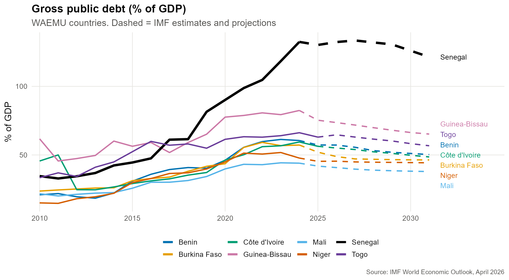
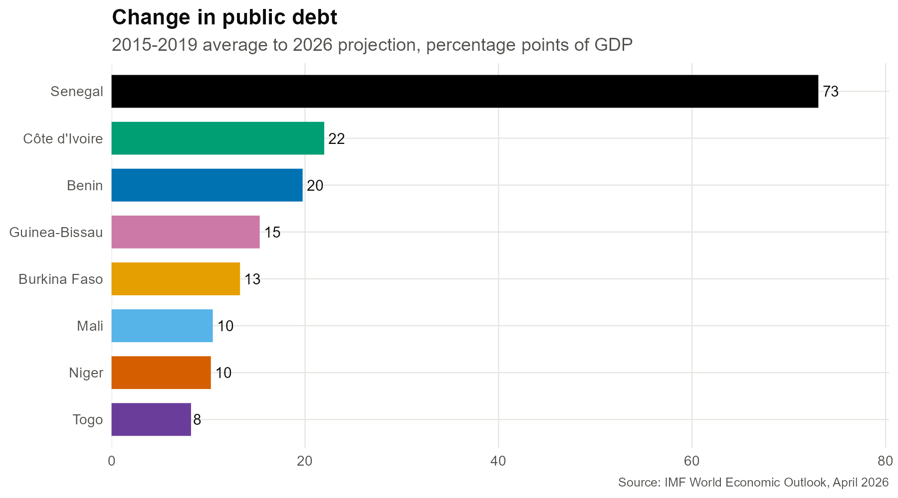
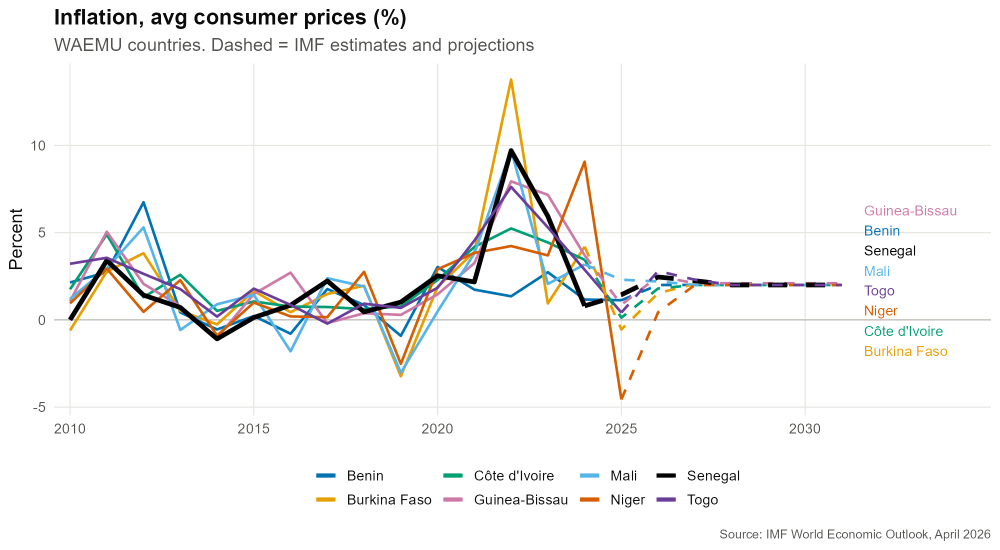
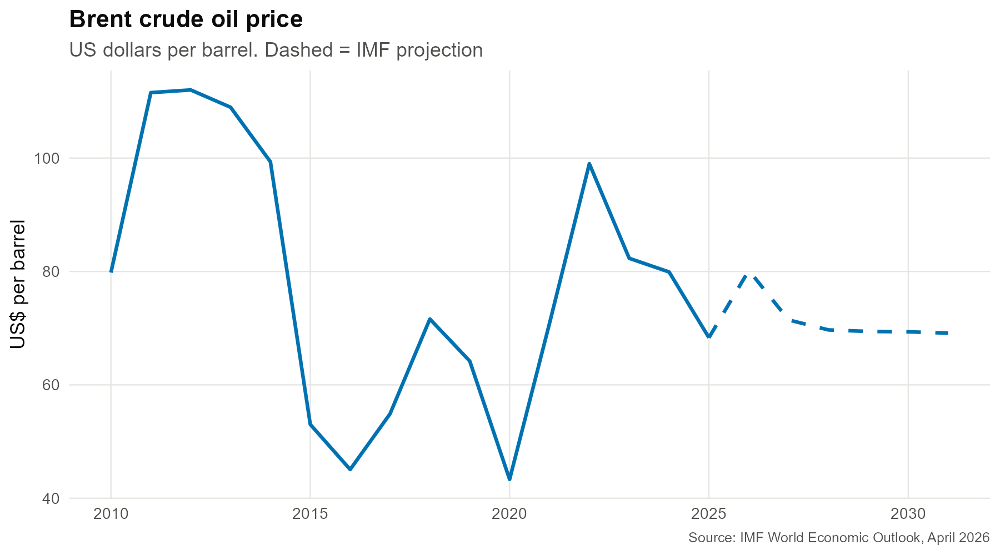
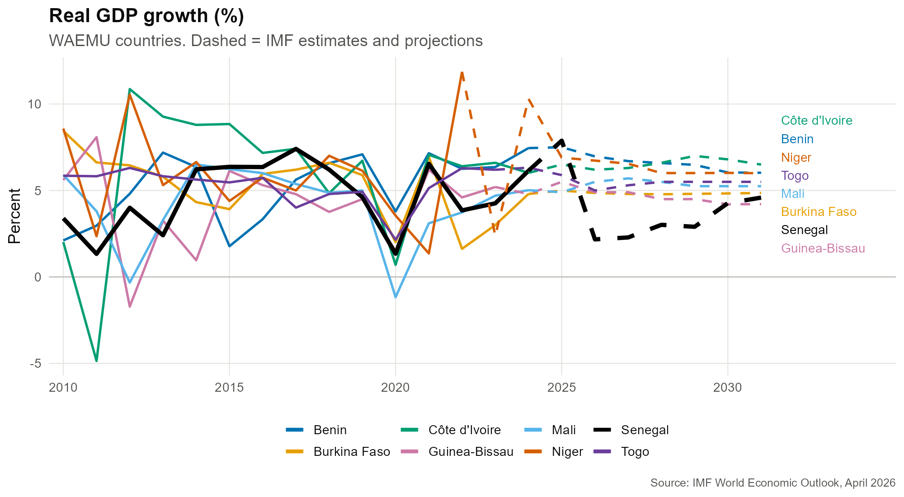
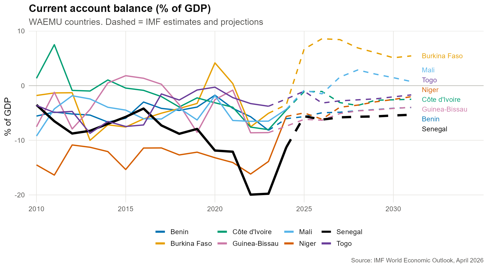

# WAEMU Macro Snapshot: Debt, Inflation and Growth Before and After 2022

How have growth, inflation and public debt changed across the eight WAEMU countries since 2015-2019, and what do the IMF's April 2026 projections imply as oil prices rise?

Countries: Benin, Burkina Faso, Côte d'Ivoire, Guinea-Bissau, Mali, Niger, Senegal, Togo.

**Full write-up with context: [analysis.md](analysis.md)**

## Data

IMF World Economic Outlook database, April 2026 edition (published April 14, 2026).
Download it from the [IMF data portal](https://data.imf.org/en/datasets/IMF.RES:WEO) and place the file next to the script. I did not include the raw file in this repo.

Indicators used: real GDP growth, inflation (average consumer prices), gross public debt (% of GDP), current account balance (% of GDP), and the Brent crude price.

Recent years are IMF estimates and projections, not observed data. The charts show them as dashed lines, and the cutoff differs by country and indicator.

## What I found

**Debt is the main story.** Every country's debt is higher than its 2015-2019 average. Côte d'Ivoire is up about 22 points of GDP, Benin about 20, and Senegal about 73, reaching roughly 132% of GDP. Most countries peaked around 2024 and are projected to edge down. Senegal is the exception, staying near 132-133%.

**Inflation spiked in 2022 and then collapsed.** Averages were under 1% in 2015-2019, jumped as high as 13.8% (Burkina Faso) in 2022, and by 2025 sat near zero. The 2026 projections are 0.4% to 2.8%, a modest rise.

**Oil is a bounce, not a spike.** Brent is projected at about $80 in 2026, up from $68 in 2025, but below the 2022 level of about $99. That helps explain why the projections show only small inflation increases.

**Growth is mostly steady, with one big outlier.** Côte d'Ivoire is projected near 6%, Benin about 7%. Senegal falls from 7.9% in 2025 to 2.2% in 2026.

**External balances are mixed.** Most countries run current account deficits that narrow over the projection period. Benin, Guinea-Bissau and Senegal (around -5% to -6% of GDP) look more exposed to price moves.

## Limits

- These are IMF projections made in April 2026. They can change, and a newer edition may be out.
- This is descriptive. With eight countries I make no causal claims about oil and inflation.
- The data does not include foreign aid, so I cannot say how aid cuts affect these countries.
- Debt levels for Senegal differ across sources and data vintages, and the Burkina Faso current account figure differs between the WEO and an IMF program review. Check the original sources before quoting numbers.

## Run it

1. Download `WEOApr2026all.xlsx` from the IMF link above and put it in this folder.
2. Install the packages: `install.packages(c("tidyverse", "readxl", "scales", "ggrepel"))`
3. Run `waemu_analysis.R`. It writes `waemu_summary_table.csv` and a `charts/` folder.
4. Knit `analysis.Rmd` to rebuild the write-up.

## Files

- `waemu_analysis.R`: loads, reshapes, summarizes and plots the data
- `analysis.Rmd` / `analysis.md`: the written analysis with charts
- `waemu_summary_table.csv`: baseline vs recent vs projected values by country
- `charts/`: debt, inflation, growth, current account, oil price, debt change
