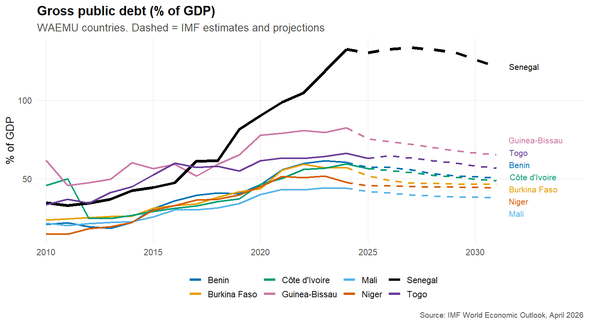
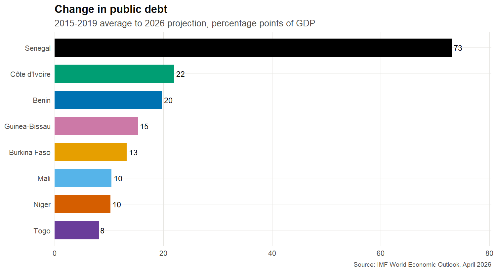
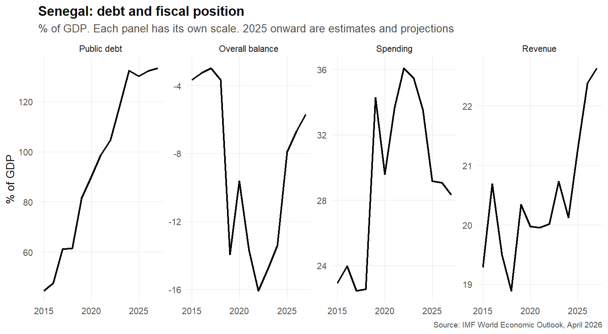
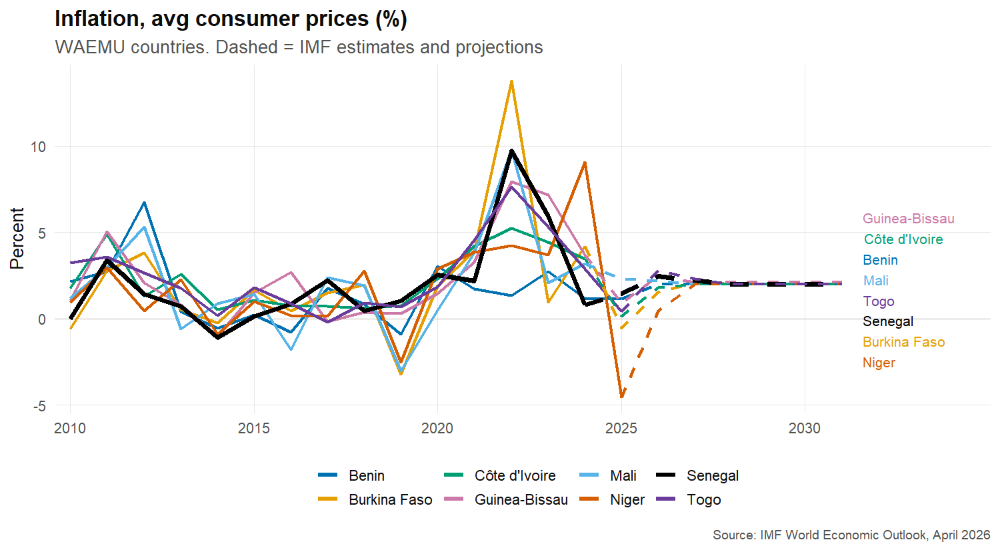
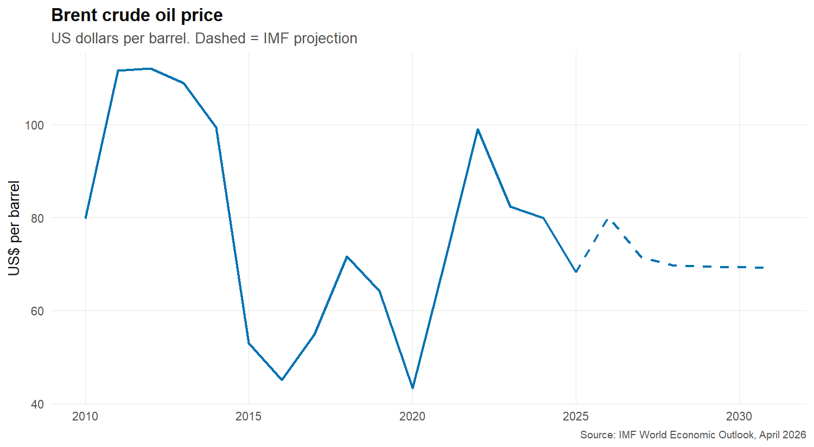
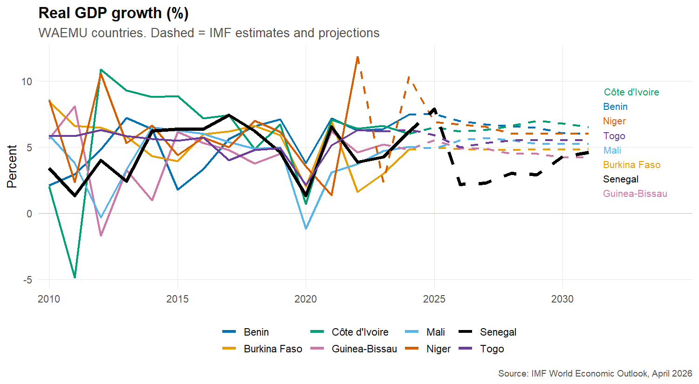
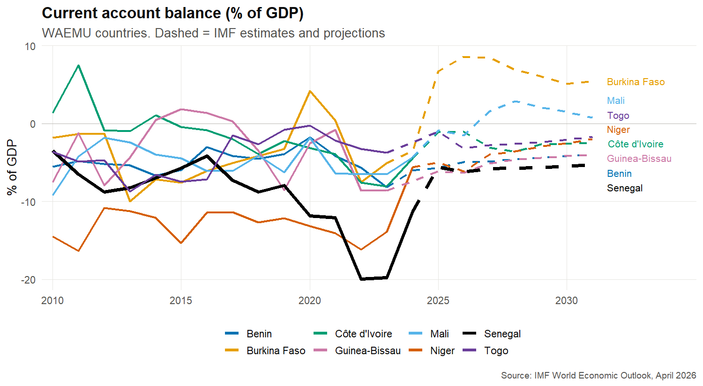

WAEMU Macro Snapshot: Analysis
================
Samira Ouattara

## Question

How have growth, inflation and public debt in the WAEMU countries
changed since 2015-2019, and what do the IMF’s April 2026 projections
imply as oil prices rise?

Data: IMF World Economic Outlook, April 2026. Recent years are estimates
and projections. Events mentioned below are context from the sources
listed at the end. They help explain the numbers, but I have not tested
them as causes.

## 1. Which countries added the most debt?

``` r
summary_tbl |>
  filter(indicator == "Gross public debt (% of GDP)") |>
  select(country, avg_2015_2019, proj_2026, change_vs_baseline) |>
  arrange(desc(change_vs_baseline)) |>
  mutate(across(where(is.numeric), ~ round(.x, 1)))
```

    ## # A tibble: 8 × 4
    ##   country       avg_2015_2019 proj_2026 change_vs_baseline
    ##   <chr>                 <dbl>     <dbl>              <dbl>
    ## 1 Senegal                59.2     132.                73.1
    ## 2 Côte d'Ivoire          33.1      55.1               22  
    ## 3 Benin                  37.5      57.2               19.7
    ## 4 Guinea-Bissau          58.3      73.6               15.3
    ## 5 Burkina Faso           35.6      48.8               13.3
    ## 6 Mali                   30.3      40.8               10.5
    ## 7 Niger                  35.2      45.5               10.3
    ## 8 Togo                   56.5      64.7                8.2

<!-- --><!-- -->

**My reading:** Every country has more debt than in 2015-2019. Senegal
is in a class of its own, up about 73 points of GDP to roughly 132%.
Côte d’Ivoire (+22) and Benin (+20) come next, and Togo is lowest (+8).

For the rest of the region, debt rises around 2020 and again after 2022.
That fits the COVID spending and revenue hit, then the 2022 food and
energy price shock and tighter global financing. Most of these countries
peak around 2024 and are projected to edge down.

Looking at the full chart, Côte d’Ivoire’s debt falls from about 50% of
GDP in 2011 to about 25% in 2012. That lines up with the 2012 HIPC debt
relief (more than \$4 billion), right after the 2010-2011 post-election
crisis, when GDP shrank by almost 5% in 2011.

### Why Senegal is different

Two things happened at once: the debt was bigger than reported, and the
deficits were very large.

``` r
sen_fiscal <- raw |>
  filter(`COUNTRY.ID` == "SEN",
         `INDICATOR.ID` %in% c("GGXWDG_NGDP", "GGXCNL_NGDP", "GGR_NGDP", "GGX_NGDP")) |>
  select(indicator_id = `INDICATOR.ID`, matches("^[0-9]{4}$")) |>
  pivot_longer(matches("^[0-9]{4}$"), names_to = "year", values_to = "value") |>
  mutate(year = as.integer(year), value = as.numeric(value)) |>
  filter(year %in% 2015:2027) |>
  pivot_wider(names_from = indicator_id, values_from = value) |>
  rename(debt = GGXWDG_NGDP, overall_balance = GGXCNL_NGDP,
         revenue = GGR_NGDP, spending = GGX_NGDP)

sen_fiscal |> mutate(across(-year, ~ round(.x, 1)))
```

    ## # A tibble: 13 × 5
    ##     year revenue spending overall_balance  debt
    ##    <int>   <dbl>    <dbl>           <dbl> <dbl>
    ##  1  2015    19.3     22.9            -3.7  44.5
    ##  2  2016    20.7     24              -3.3  47.5
    ##  3  2017    19.5     22.5            -3    61.1
    ##  4  2018    18.9     22.6            -3.7  61.5
    ##  5  2019    20.3     34.3           -13.9  81.5
    ##  6  2020    20       29.6            -9.6  90.1
    ##  7  2021    20       33.7           -13.7  98.7
    ##  8  2022    20       36.1           -16.1 105. 
    ##  9  2023    20.7     35.5           -14.8 118. 
    ## 10  2024    20.1     33.5           -13.4 132. 
    ## 11  2025    21.3     29.2            -7.9 130. 
    ## 12  2026    22.4     29.1            -6.7 132. 
    ## 13  2027    22.6     28.3            -5.7 133.

``` r
cum_check <- function(from, to) {
  tibble(
    period = paste(from, "to", to),
    debt_change = sen_fiscal$debt[sen_fiscal$year == to] -
                  sen_fiscal$debt[sen_fiscal$year == from],
    cumulative_deficits = -sum(sen_fiscal$overall_balance[
      sen_fiscal$year > from & sen_fiscal$year <= to])
  )
}

bind_rows(cum_check(2015, 2019), cum_check(2019, 2024), cum_check(2022, 2024)) |>
  mutate(across(where(is.numeric), ~ round(.x, 1)))
```

    ## # A tibble: 3 × 3
    ##   period       debt_change cumulative_deficits
    ##   <chr>              <dbl>               <dbl>
    ## 1 2015 to 2019        37                  23.8
    ## 2 2019 to 2024        50.9                67.6
    ## 3 2022 to 2024        27.7                28.2

<!-- -->

**1. Hidden debt came to light.** A court audit found undisclosed
borrowing going back to 2019. One estimate puts unrecorded external debt
at about 16% of GDP by the end of 2023, including roughly \$2 billion of
unreported disbursements in 2023 alone. The audit put 2023 debt near
99.7% of GDP and the 2023 deficit at 12.3%, against 74% to 81% and 4.9%
in the figures reported at the time. So part of the jump is old
borrowing becoming visible. The exact levels differ by source and
vintage, which is why this WEO file (118% for 2023) does not match the
audit number.

**2. The deficits were very large.** The overall deficit was about 3% to
4% of GDP from 2015 to 2018, then sits between 10% and 16% from 2019 to
2024. The reason is spending, which goes from about 23% of GDP in 2018
to between 29% and 36%, while revenue stays flat near 20%. In the second
table, debt rose 27.7 points from 2022 to 2024, and cumulative deficits
add up to 28.2 points, so deficits explain almost all of the recent
rise. From 2019 to 2024 the deficits add up to more (67.6 points) than
the debt increase (50.9), because growth and inflation made the economy
bigger and pulled the ratio down.

**A caution about the data:** the series jumps in 2019, with debt up 20
points in one year and the deficit going from 3.7% to 13.9%. This
probably reflects restated figures from the audit, not a single-year
shock. I have not confirmed how the IMF revised the history, so I read
the 2019 jump with care.

**Where it stands now:** debt is projected to level off near 132% as
deficits narrow to about 8% in 2025 and about 6% to 7% in 2026 and 2027.
The IMF paused its earlier program, and on September 1, 2026 it reached
a staff-level agreement on a new 36-month, \$2.2 billion program. The
government chose to “reprofile” its debt (longer maturities, new
interest rates) rather than restructure it, and debt in CFA francs is
excluded. My data is from the April 2026 WEO, so it predates that
agreement.

**What I could not find:** what the extra spending was for (investment
projects, subsidies, state companies). I make no claim about that
without a source.

## 2. Does inflation move with oil prices?

``` r
infl_oil <- weo |>
  filter(indicator_id == "PCPIPCH", year >= 2010, year <= 2025) |>
  left_join(brent, by = "year")

infl_oil |>
  group_by(country) |>
  summarise(correlation = round(cor(value, usd_per_barrel, use = "complete.obs"), 2),
            years = n())
```

    ## # A tibble: 8 × 3
    ##   country       correlation years
    ##   <chr>               <dbl> <int>
    ## 1 Benin                0.36    16
    ## 2 Burkina Faso         0.31    16
    ## 3 Côte d'Ivoire        0.42    16
    ## 4 Guinea-Bissau        0.28    16
    ## 5 Mali                 0.44    16
    ## 6 Niger                0.18    16
    ## 7 Senegal              0.2     16
    ## 8 Togo                 0.39    16

<!-- --><!-- -->

**My reading:** The correlation is positive for every country but weak
to moderate (about 0.2 to 0.4 in the level of oil prices). When I use
the change in oil prices, Mali, Burkina Faso and Côte d’Ivoire are
higher, near 0.5. Each country has only 16 yearly points, so I would not
call any of this strong evidence.

The calendar explains why. In 2022 oil was near \$99 and inflation
spiked, but the war in Ukraine also pushed up food and energy prices
more broadly, and the regional central bank (BCEAO) raised rates from
2022 through 2023. In 2025 oil fell to about \$68, but inflation dropped
to roughly zero or below mainly because of strong domestic harvests and
cheaper imports, according to regional reporting. Niger’s deflation of
about 4.7% is an example. So oil matters, but food prices and harvests
look just as important in this region.

The projections show a modest rebound (0.4% to 2.8% in 2026), consistent
with a regional target of 1 to 3% and an oil price near \$80.

## 3. What happened in Senegal?

``` r
weo |>
  filter(country == "Senegal", year >= 2019,
         indicator_id %in% c("NGDP_RPCH", "GGXWDG_NGDP", "BCA_NGDPD")) |>
  select(year, indicator, value, projection) |>
  pivot_wider(names_from = indicator, values_from = value)
```

    ## # A tibble: 13 × 5
    ##     year projection `Real GDP growth (%)` `Gross public debt (% of GDP)`
    ##    <int> <lgl>                      <dbl>                          <dbl>
    ##  1  2019 FALSE                       4.61                           81.5
    ##  2  2020 FALSE                       1.34                           90.1
    ##  3  2021 FALSE                       6.54                           98.7
    ##  4  2022 FALSE                       3.85                          105. 
    ##  5  2023 FALSE                       4.26                          118. 
    ##  6  2024 FALSE                       6.14                          132. 
    ##  7  2025 TRUE                        7.88                          130. 
    ##  8  2026 TRUE                        2.17                          132. 
    ##  9  2027 TRUE                        2.28                          133. 
    ## 10  2028 TRUE                        3.02                          132. 
    ## 11  2029 TRUE                        2.90                          131. 
    ## 12  2030 TRUE                        4.27                          126. 
    ## 13  2031 TRUE                        4.59                          121. 
    ## # ℹ 1 more variable: `Current account balance (% of GDP)` <dbl>

<!-- -->

**My reading:** Debt climbs every year from 81% of GDP in 2019 to about
132% in 2024 and stays there in the projections. Growth jumps to 7.9% in
2025 and then falls to 2.2% in 2026, about 4 points below its 2015-2019
average. The current account deficit narrows from about 20% of GDP in
2022 and 2023 to about 6% in 2025.

The improvement in 2025 matches reporting that Senegal’s growth was
driven by oil, while underlying weakness persisted. I think the 2026
slowdown reflects the oil boost fading, a government under debt
pressure, and a paused IMF program. This is my interpretation. I did not
find a source that explains the IMF’s exact 2.2%, so it is a hypothesis
I would check against the IMF country report.

Note that the WEO shows 7.9% growth for 2025, while the World Bank
estimate I found is lower (6.7%). Different sources and dates give
different numbers.

## 4. Burkina Faso’s current account swing

``` r
weo |>
  filter(country == "Burkina Faso", year >= 2018, indicator_id == "BCA_NGDPD") |>
  select(year, value, projection)
```

    ## # A tibble: 14 × 3
    ##     year  value projection
    ##    <int>  <dbl> <lgl>     
    ##  1  2018 -4.18  FALSE     
    ##  2  2019 -3.26  FALSE     
    ##  3  2020  4.17  FALSE     
    ##  4  2021  0.392 FALSE     
    ##  5  2022 -7.54  FALSE     
    ##  6  2023 -5.06  FALSE     
    ##  7  2024 -3.48  TRUE      
    ##  8  2025  6.71  TRUE      
    ##  9  2026  8.59  TRUE      
    ## 10  2027  8.43  TRUE      
    ## 11  2028  6.92  TRUE      
    ## 12  2029  6.04  TRUE      
    ## 13  2030  5.11  TRUE      
    ## 14  2031  5.45  TRUE

<!-- -->

**My reading:** The balance moves between deficit and surplus: about +4%
in 2020, deep deficits in 2022 and 2023, then +6.7% in 2025 and +8.6% in
the 2026 projection.

The most likely driver is gold. An IMF program review reports gold
exports up 43% in 2025 on prices around \$3,200 an ounce, and says this
shifted the external position into surplus. Burkina Faso also had two
coups in 2022 and a worsening security situation, and the IMF’s growth
forecast depends on security improving. Fiscal policy also tightened,
with the deficit falling from 5.8% to 3.5% of GDP.

One thing to check: that review puts the 2025 surplus at only 1.1% of
GDP, while the April 2026 WEO shows 6.7%. I do not know the reason
(different vintage or definition), so I treat the size of the surplus as
uncertain and the direction as solid.

## 5. Conclusions and limits

- **Debt is the main vulnerability.** All eight countries have more debt
  than in 2015-2019, and Senegal is in a different category, with debt
  above 130% of GDP and a restructuring under discussion.
- **Oil is a bounce, not a shock.** Brent rises to about \$80 in 2026,
  below the 2022 level, and projected inflation stays within a low
  range. The bigger drivers in this region look like food prices,
  harvests and global conditions.
- **Politics and security shape the outliers.** Burkina Faso’s
  gold-driven surplus and Niger’s oil exports and post-coup sanctions
  show that country events matter as much as global prices.
- **Limits:** these are projections, not facts. Eight countries is a
  small sample, and I tested no causes. The data says nothing about
  foreign aid, which the IMF has flagged as a risk.
- **Next steps:** compare these figures with the IMF country reports,
  look at Senegal’s debt revisions across WEO vintages, and add aid data
  from the World Bank.

## Sources

- [FinDevLab: hidden debt of
  Senegal](https://findevlab.org/what-we-learn-from-the-new-international-debt-statistics-on-the-hidden-debt-of-senegal/)
- [Credendo: Senegal fiscal position worse than
  stated](https://credendo.com/en/knowledge-hub/senegal-fiscal-position-significantly-worse-previously-stated)
- [Engineering News: Senegal debt, September
  2026](https://www.engineeringnews.co.za/article/light-at-the-end-of-senegals-debt-tunnel-2026-09-25)
- [Bretton Woods Project: Senegal’s hidden
  debt](https://www.brettonwoodsproject.org/2025/12/senegals-hidden-debt-sparks-questions-about-imfs-oversight/)
- [Ecofin: BCEAO cuts key rate as WAEMU faces
  deflation](https://www.ecofinagency.com/news-finances/0503-53481-bceao-cuts-key-rate-to-3-00-as-waemu-faces-deflation)
- [Ecofin: IMF fourth review of Burkina
  Faso](https://www.ecofinagency.com/news/1902-53078-imf-completes-fourth-review-of-burkina-fasos-extended-credit-facility-and-approves-124-3-million-climate-resilience-program)
- [World Bank: Niger
  overview](https://www.worldbank.org/en/country/niger/overview)
- [Ecofin: Senegal’s growth driven by
  oil](https://www.ecofinagency.com/news/1004-54577-senegal-s-growth-rises-to-6-7-driven-by-oil-as-underlying-weakness-persists)
- [World Bank and IMF: debt relief for Côte d’Ivoire, June
  2012](https://www.worldbank.org/en/news/press-release/2012/06/26/imf-world-bank-announce-more-than-4-billion-debt-relief-cote-divoire)
- IMF World Economic Outlook database, April 2026
